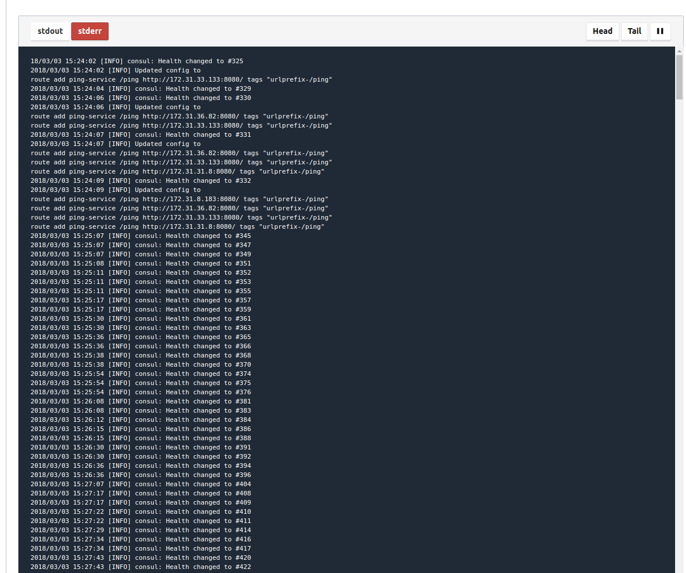

# Misc stuff

## Deployment

* Test/ validate the job-file before deployment: ```nomad plan <job-file>```
* Show the status for a deployment ```nomad status <job-name>```
* Show the cause of a failed deployment ```nomad status <allocation-id>```

## Logging

### Server Logs

You have to log into a nomad-server node first.

* Server-Log: ```/opt/nomad/log/```
* Nomad/ Consul install log: ```/var/log/user-data.log```
* Cloud-Init-Log: ```/var/log/cloud-init.log``` and ```/var/log/cloud-init-output.log```

### Enable Service-Logs

For being able to see logging in nomad ui and on commandline you have to enable access to the private ip-addresses of your nomad-servers. With standard setup your nomad ui is not able to show the logs.


Here a tool named [sshuttle](https://sshuttle.readthedocs.io/en/stable/) helps. With this tool you can open a ssh-tunnel to one of your nomad-servers. Doing this you are blended into the VPC and can access the nodes using their private ips.

#### Set up sshuttle

```bash
# install
sudo apt-get install sshuttle
```

#### Open ssh tunnle

```bash
# open the sshuttle
server_ip=$(get_nomad_server_ip.sh) &&\
subnet_mask=$(get_nomad_subnet_mask.sh) &&\
sshuttle -v -r ubuntu@$server_ip -e 'ssh -v -o StrictHostKeyChecking=false -i ~/.ssh/kp_instances.pem ' --dns -H $subnet_mask
```

#### Show the logs over commandline

```bash
# stderr has to be used since currently everything is logged there
nomad logs -stderr -f -job ping_service
```

#### Logs in ui

Current everything is shipped to stderr.
