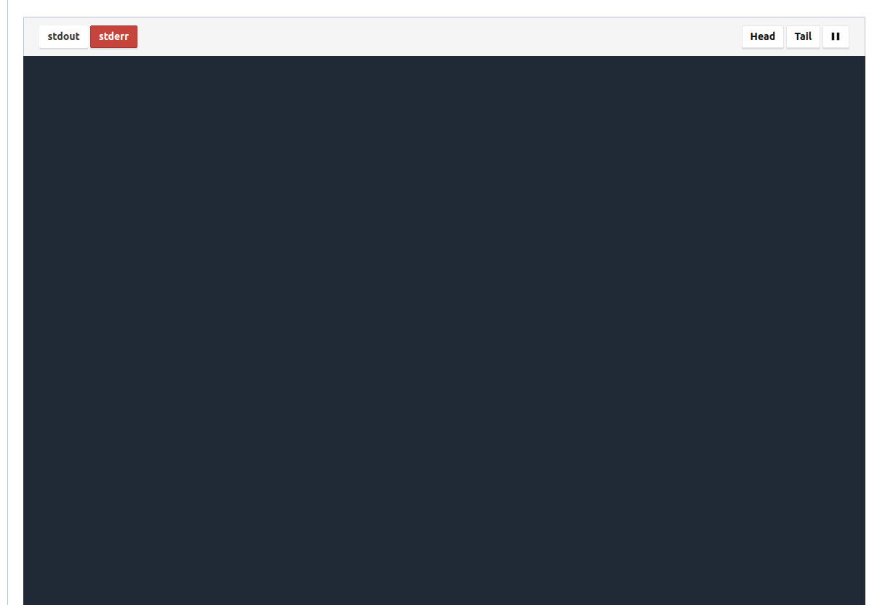
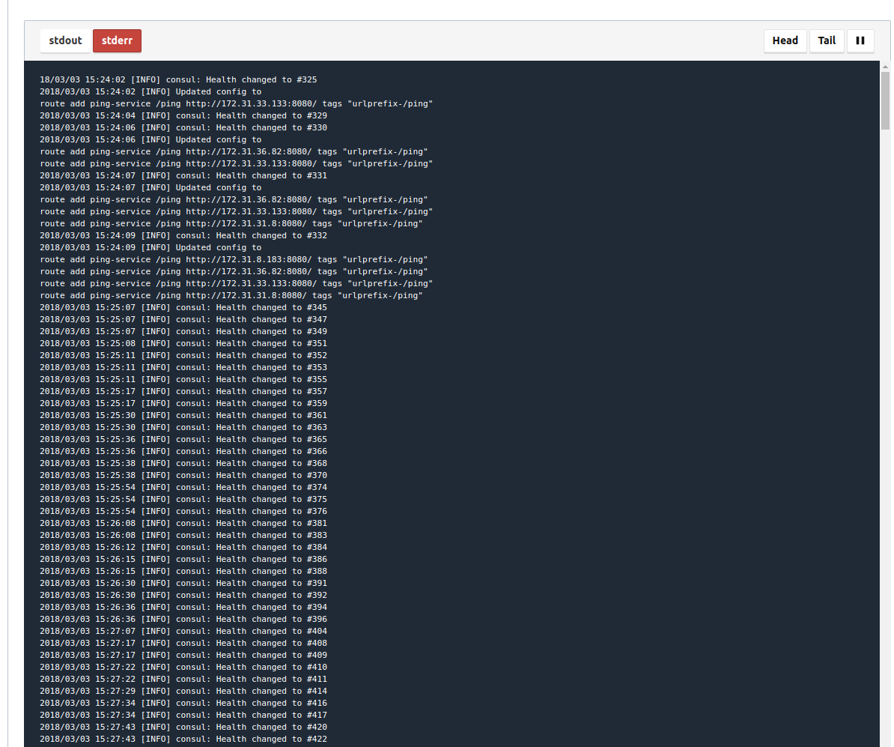

# First Nomad Cluster (MS 2)

## 2018-02-27

### Sample from scratch

#### Create the infrastructure

```bash
# 1. Clone the infrastructure-repo
git clone git@github.com:ThomasObenaus/terraform-aws-nomad.git &&\
cd terraform-aws-nomad

# 2. Build the infra
terraform init &&\
terraform plan -out file.plan &&\
terraform apply file.plan
```

#### Configure and check nomad

```bash
# Wait for the servers getting ready and set the NOMAD_ADDR env variable
server_ip=$(examples/nomad-examples-helper/get_nomad_server_ip.sh) &&\
export NOMAD_ADDR=http://$server_ip:4646

# Show some commands
examples/nomad-examples-helper/nomad-examples-helper.sh
```

#### Deploy the ping_service

```bash
# 1. Deploy fabio
nomad run examples/nomad-examples-helper/fabio.nomad

# 2. Deploy ping_service
#!! first you have to adjust the job-definition
# in examples/nomad-examples-helper/ping_service.nomad
# the CONSUL_SERVER_ADDR variable must be set to the addr of
# the consul server (which is in this setup) the same as the one of the nomad-server
nomad run examples/nomad-examples-helper/ping_service.nomad
```

#### Test call to the service

```bash
# Currently we havent set up a elastic loadbalancer, thus we have to chose one
# of the nomad nodes and use their ip for the call.
# On each node a fabio is listening on port 9999. Fabio will route our /ping call to the ping_service.

# 1. find the ip of one instance
instance_ip=$(examples/nomad-examples-helper/get_nomad_client_info.sh | awk '!/INSTANCE/{print $1}' | head -n 1)

# call the service
curl http://$instance_ip:9999/ping
```

### Logging

For being able to see logging in nomad ui and on commandline you have to use enable access to the private ip-addresses of your nomad-servers. With standard setup your nomad ui is not able to show the logs.


Here a tool named [sshuttle](https://sshuttle.readthedocs.io/en/stable/) helps. With this tool you can open a ssh-tunnel to one of your nomad-servers. Doing this you are blended into the VPC and can access the nodes using their private ips.

### Set up sshuttle

```bash
# install
sudo apt-get install sshuttle
```

### Open ssh tunnle

```bash
# open the sshuttle
server_ip=$(examples/nomad-examples-helper/get_nomad_server_ip.sh) &&\
subnet_mask=$(examples/nomad-examples-helper/get_nomad_subnet_mask.sh) &&\
sshuttle -v -r ubuntu@$server_ip -e 'ssh -v -o StrictHostKeyChecking=false -i ~/.ssh/kp_instances.pem ' --dns -H $subnet_mask
```

### Show the logs over commandline

```bash
# stderr has to be used since currently everything is logged there
nomad logs -stderr -f -job ping_service
```

### Logs in ui

Current everything is shipped to stderr.


#### Clean up everything

```bash
terraform destroy
```

### Issues with deployment of ping_service on nomad

Hint: Export the NOMAD_ADDR in order to avoid typing the ```-address``` parameter for each nomad commadn. ```export NOMAD_ADDR=http://<ip-address of your nomad-master>:<port>```

Note: ```Constraint "missing drivers" filtered 6 nodes``` when applying a nomad task with a docker driver means that docker is not installed. The problem was instead of building an AMI with docker from the example (see: 2018-02-22) I buit the nomad-consul.json and not the nomad-consul-docker.json

Note: Changing the ami in an AWS autoscaling group does not update any instances. With the change the ASG just knows which ami to take for new instances. Thus you have to terminate instances in order to start the exchange of ami's.


## 2018-02-22

### Started with the Nomad module from terraform-module registry

#### Create an AMI with Consul and Nomad

Docu: https://github.com/hashicorp/terraform-aws-nomad/tree/master/examples/nomad-consul-ami
Note: It is possible to use aws credential profiles for packer

```bash
"builders": [
    {
      "profile": "home",
      ..
    }
    ...
```

ami: ami-adcba8c2

#### Set up the cluster

##### Build the infrastructure

```bash
git clone git@github.com:ThomasObenaus/terraform-aws-nomad.git
cd terraform-aws-nomad
terraform init
terraform plan -out file.plan
terraform apply file.plan
```

##### Show the examples to interact with the nomad-cluster

Define in ```examples/nomad-examples-helper/nomad-examples-helper.sh``` the name of your aws-profile by adjusting ```readonly AWS_PROFILE_NAME="<your profile-name>"```.

```bash
#call the script to show the example nomad instructions
examples/nomad-examples-helper/nomad-examples-helper.sh

# assumption one of your nomad server ip's is: 18.197.84.170

# show the servers
nomad server-members -address=http://18.197.84.170:4646

# open the nomad ui
firefox http://18.197.84.170:4646 &
```

### Installed nomad from https://www.nomadproject.io/intro/getting-started/install.html

Commands for vagrant:

```bash
#enter the folder containing the VagrantFile
cd nomad

#create the vagrant box
vagrant up

#enter the vagrant box
vagrant ssh

#destroy the box afterwards
vagrant destroy
```

Commands for nomad:

```bash
#start nomad agent based on given config (server or client)
#for details see: https://www.nomadproject.io/intro/getting-started/cluster.html
nomad agent -config <xyz>.hcl

#plan job
nomad plan <xyz>.nomad

#apply job
nomad run <xyz>.nomad

#stop job
nomad stop <xyz>.nomad

#show status of job
nomad status <jobname>

#show status of nodes
nomad node-status
```

Nomad UI can be visited at http://localhost:4646/